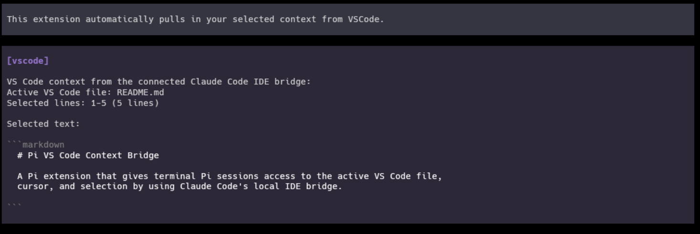
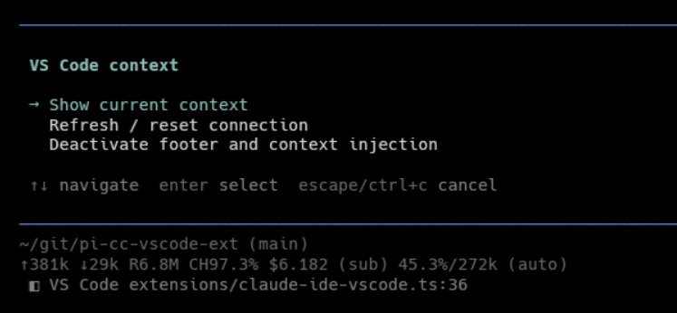
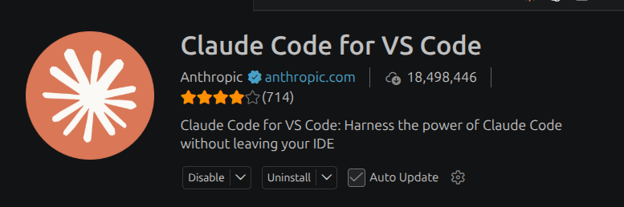

# Pi VS Code Context Bridge

This extension reuses the existing Claude Code VSCode extension to co-opt it's TUI context injection functionality to automatically pull your selected VS Code context into Pi, so
terminal sessions can see the active file, cursor, and highlighted code from
your editor.

<p align="center">
  
</p>

## Features

- Registers a `vscode_context` tool that the model can call for the current VS
  Code editor context.
- Adds a `/vscode` command for viewing bridge status, refreshing state, and
  toggling automatic context injection for the current session.
- Shows a compact footer status for disconnected, active-file, and selected-line
  states.
- Automatically injects changed VS Code context before an agent turn, while
  deduplicating unchanged context by fingerprint.
- Keeps Claude Code IDE bridge authorization tokens local and out of tool,
  prompt, and status output.

## Requirements

- Pi with package extension support.
- Node.js `>=22.18`.
- VS Code connected through Claude Code's IDE integration.

This extension depends on Claude Code's local IDE bridge lock files under
`~/.claude/ide/*.lock`. If no Claude Code IDE bridge is active, the extension
reports a disconnected state and does not inject editor context automatically.

## Installation

Install the package with Pi:

```bash
pi install npm:pi-cc-vscode-ext
```

You can also install directly from a Git checkout or run the extension during
local development:

```bash
pi install ./
pi -e ./extensions/claude-ide-vscode.ts
```

Pi loads the extension through the package manifest:

```json
{
  "pi": {
    "extensions": ["./extensions/claude-ide-vscode.ts"],
    "image": "https://raw.githubusercontent.com/JoeHelbing/pi-cc-vscode-ext/main/images/vscode-context-injection-example.png"
  }
}
```

## Usage

Start Pi from a workspace that is also open in VS Code through Claude Code. When
VS Code context is available, Pi automatically injects changed editor context
before each agent turn.

Use the tool from the model when explicit editor context is useful:

```text
Use vscode_context to inspect my current VS Code selection.
```

Use the slash command for interactive control:

```text
/vscode
```

The command shows the current bridge status and includes actions to refresh,
reset automatic injection state, or toggle automatic injection for the session.

## Screenshots

<p align="center">
  
</p>

<p align="center">
  
</p>

<p align="center">
  
</p>

## How it works

Claude Code's VS Code integration writes local lock files under
`~/.claude/ide/*.lock`. Each lock records the local WebSocket port, process id,
workspace folders, IDE metadata, and an authorization token.

This extension:

1. Reads Claude Code IDE lock files from the local machine.
2. Prefers live locks whose workspace contains Pi's current working directory.
3. Connects to `ws://127.0.0.1:<port>` with the lock token.
4. Calls Claude Code's MCP-style `getLatestSelection` IDE tool.
5. Normalizes the active file path, cursor or selection range, selected text,
   and status summary for Pi.

Authorization tokens are used only for the local WebSocket request. They are not
returned by `vscode_context`, inserted into model context, printed in status
text, or written by this package.

## Package contents

The npm package includes:

- `extensions/claude-ide-vscode.ts` - the Pi extension and bridge logic.
- `images/vscode-context-injection-example.png` - package/gallery preview image.
- `images/vscode-command-menu-and-footer.png` - command menu and footer screenshot.
- `images/claude-code-vscode-bridge.png` - Claude Code bridge screenshot.
- `README.md` - package documentation.
- `LICENSE` - Apache 2.0 license text.
- `package.json` - package metadata and Pi manifest.

## Limitations

- Claude Code's local IDE bridge and lock-file format are not public Pi APIs and
  may change.
- The bridge only works when Claude Code's VS Code integration is running on the
  same machine as Pi.
- Selected text may be truncated before prompt injection to avoid oversized
  context.

## Development

Run the syntax check:

```bash
npm run check
```

Preview the npm package contents:

```bash
npm pack --dry-run
```

## License

Apache-2.0
